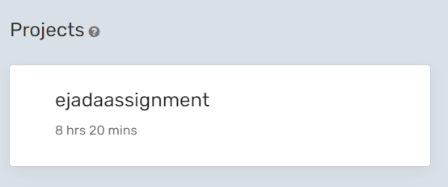

# React native Code Assignment

Ejada - React Native code assignment project

### App structure

- Contacts List Page
- About App Page

### Used libraries

- React Native
- React Native Fast Image
- React Native Navigation
- React Native Crop Image Picker
- Axios
- React Query
- React Native Async Storage
- React Native Paper
- React Native Reanimated
- React Native UUID
- React Native Vectors Icon
- TWRNC
- React Native Screens
- Husky
- Eslint
- Prettier

### Hooks

- useArray -> Create custom array state with functions
- useCounter -> To increment or decrement states
- useDebounce -> Used to debounced the result or function
- useFetch -> Customs Fetch hooks for CRUD I made it for RESET API using "axios,react query"
- useFirstMountState -> Check if the page its first mount
- useImageChanger -> Custom hooks madid for "Pick up image from gallery, Check local has image with uuid"
- useIsLoading -> easy state use for loading pages or load data
- usePortal -> for active/deactive showing components
- useRootNavigation -> one line code for custom useNavigation for root
- useStorageOrm -> The largest hooks I made it for async storage to save data like DATABASE Table
- useToggle -> toggle state
- useUpdateEffect -> just call function when update deps

### Code Time
